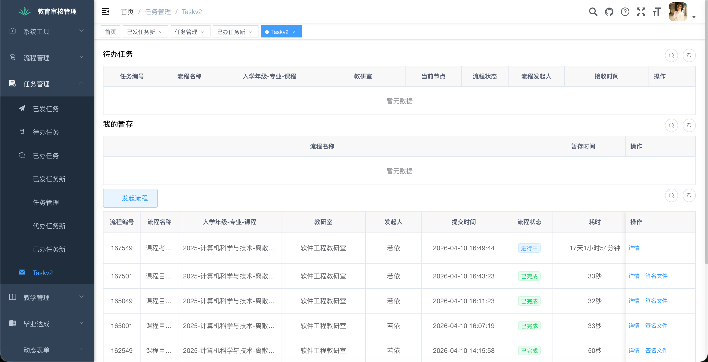
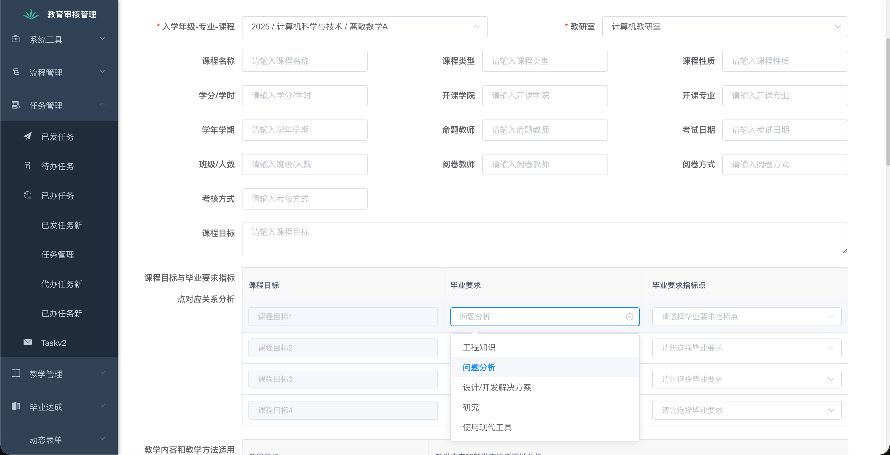
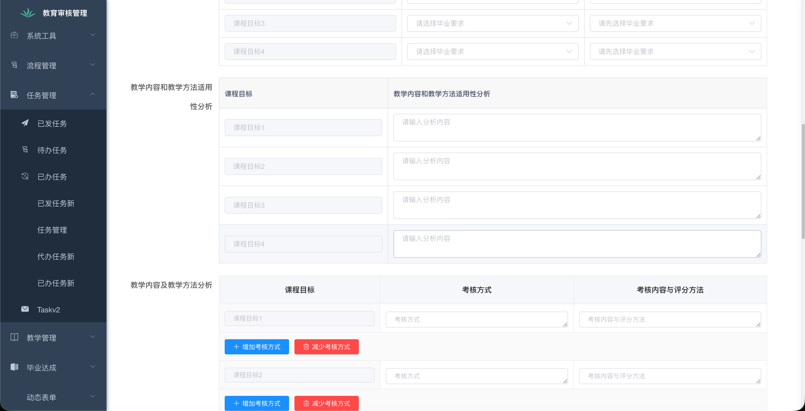
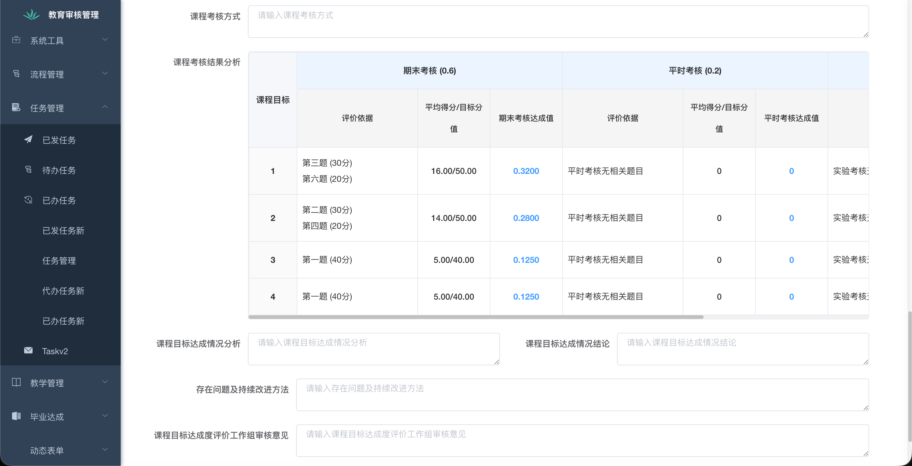
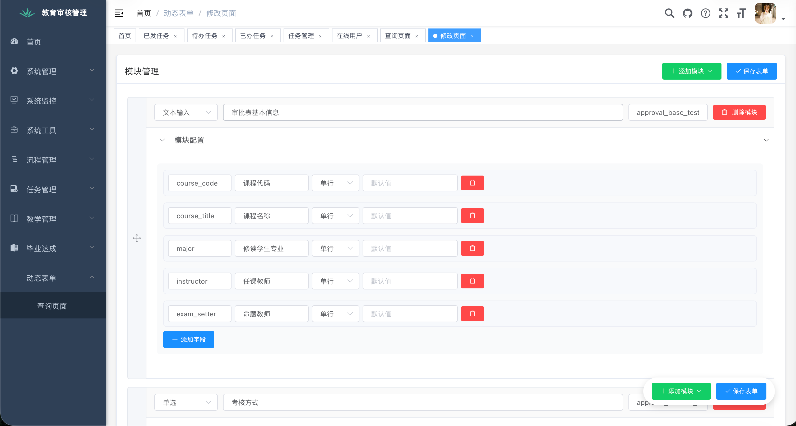
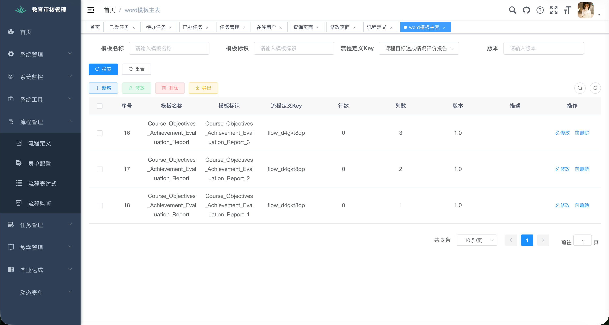
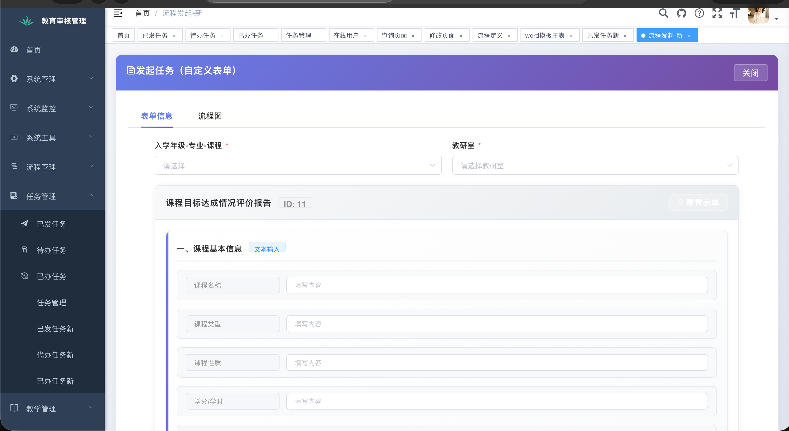
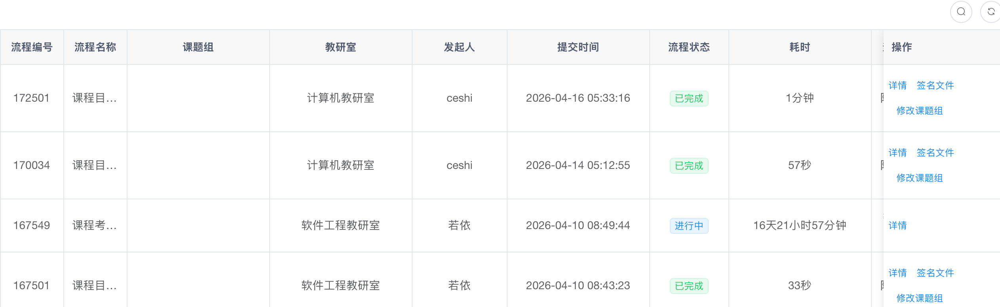

# 考试审批与毕业达成度系统

### 项目背景

本项目源于 **徐州工程学院大数据学院** 在教学管理信息化过程中的实际需求，最初用于支持考试审批流程与毕业达成度评估工作的数字化与规范化。

在实践过程中，我们将重点进一步聚焦到“毕业达成度报告生成”这一核心问题：为**各专业**提供一套可自助使用的工具，用于完成毕业要求达成度分析与报告输出。系统面向专业侧，而非评估中心——各专业负责数据与分析，评估中心仅进行最终归档与审核。

## 项目介绍

考虑到不同专业在指标体系、数据结构和分析方式上的差异，本项目采用**模块化设计 + 动态表单配置**的方式，支持灵活构建流程与模型，以保证良好的通用性与扩展性。

该项目主要提供了一个标准化的审批流程，供各级人员快速在线上完成各种各种表格、文件的审批，并支持配置word模版，将平台上审批结束的表单内的信息填充到word模版上并导出，目前还支持电子签名的填充。

此外，项目还有一个达成度系统，可以配置各门课程的指标点并支持权重配置，通过导入学生的成绩数据，可以看到学生的达成度数据。

项目遵循“**快速原型 + 持续迭代**”的开发策略：从单一专业试点出发，快速构建原型系统，在实践中不断抽象通用能力，逐步扩展至多专业场景。

## 快速开始

### 1. 导入数据库

将项目中的 SQL 导入到你的 MySQL：在目标库（库名需与 JDBC 一致，默认 **`exam`**）中执行 **`xzit-starter/src/main/resources/db/migration/V0.0.1__Baseline.sql`**。该文件按 Flyway 版本约定命名并放在 `db/migration` 下，便于日后接入 Flyway 时直接使用（当前工程未引入 Flyway 依赖，不会自动执行）。

### 2. 修改配置

主要涉及 **`xzit-starter/src/main/resources/application-dev.yml`**（开发）或 **`application-prod.yml`**（生产）；通用项在 **`application.yml`**。

| 能力 | 修改位置（示例） |
|------|------------------|
| **MySQL** | `spring.datasource.druid.master.url` / `username` / `password`；或使用环境变量 **`DB_MASTER_USERNAME`**、**`DB_MASTER_PASSWORD`**（密码建议走环境变量） |
| **Redis** | `spring.redis.host`、`port`、`database`、`password`；密码可用 **`REDIS_PASSWORD`** |
| **阿里云 OSS** | `application.yml` 中 `aliyun.oss.endpoint`、`aliyun.oss.bucket-name`；密钥对应 **`ALIYUN_ACCESS_KEY_ID`**、**`ALIYUN_ACCESS_KEY_SECRET`**（或在本机 yml 中配置 `aliyun.access-key-id` / `aliyun.access-key-secret`，勿提交仓库） |
| **令牌** | `token.secret`，或使用 **`TOKEN_SECRET`** |
| **服务端口** | `application.yml` 中 `server.port`（默认 `8080`） |

按需调整 **`ruoyi.profile`**（本地文件路径）、Druid 控制台账号等，见对应 yml 注释。

### 3. 部署方式

- **本机 / 调试**：项目根目录执行 `make run`（先 `package` 再 `java -jar`，默认 `dev`）。指定环境：`make run PROFILE=prod`。
- **等价命令**：`mvn clean package -DskipTests` 后执行  
  `java -jar xzit-starter/target/exam-back.jar --spring.profiles.active=dev`  
  生产请将 `dev` 换成实际 profile，并通过环境变量注入敏感配置。

## 依赖环境

建议使用以下版本（与项目当前依赖保持一致）：

- JDK 1.8 或 17
- Maven 3.6+
- MySQL 5.7 或 8.0
- Redis 6.x（或兼容版本）

## 功能与特性

### 功能预览

*图表 5 - v3 管理页面*

*图表 6 - 达成评价报告 1*

*图表 7 - 达成评价报告 2*

*图表 8 - 达成评价报告 3*

该版本使用模块化动态表单配置，目前功能基本实现，模版的数据处理放在后端进行。

总的操作流程为：在"**已发任务新**"发起任务，随后其他用户在"**待办任务**"进行审批，最后可以在"**已发任务**"页面生成签名文件（需要正确配置模版）。

部分复杂表格单出行列配置，并拆成多个模版。

*图表 1 - 动态表单配置页面*

*图表 2 - 模版配置*

*图表 3 - 表单页面*

*图表 4 - 任务完成后的状态*

## 内置功能

- 用户管理
- 权限管理
- 流程管理
- 流程审批
- word导出
- 达成度数据统计

## 开源许可

本项目采用 **Apache License 2.0**，完整条款见仓库根目录 [`LICENSE`](LICENSE)。欢迎参与贡献，请先阅读 [`CONTRIBUTING.md`](CONTRIBUTING.md)。

